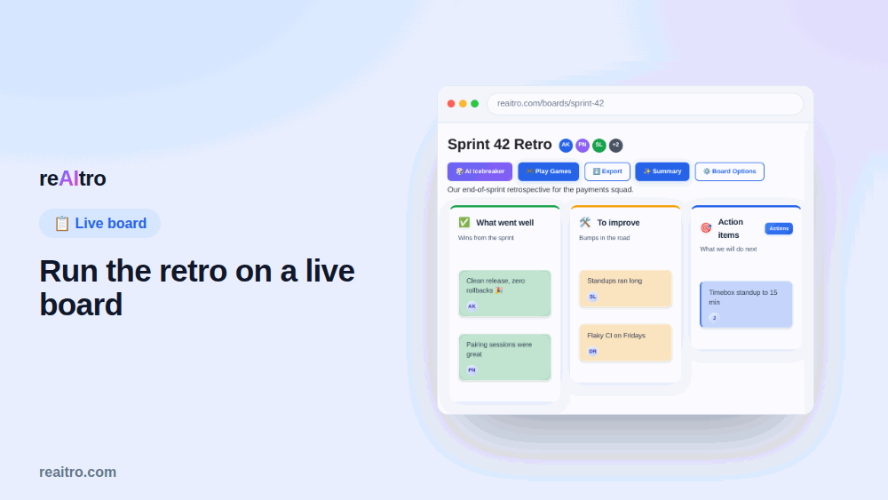

# reAItro - AI Retrospectives & Team Games

> Remote sprint retros your team actually shows up for.

**reAItro** (a.k.a. RetroBoard) is a free, real-time retrospective tool built
for remote and distributed agile teams. Run collaborative boards, let AI
cluster the feedback and write the summary + action items, and warm up quiet
rooms with built-in team games.

🔗 **Live app:** [reaitro.com](https://reaitro.com) - no credit card, and
teammates can join a board as a guest with just a name.

<p align="center">
  <a href="https://www.producthunt.com/products/reaitro?utm_source=badge-follow&utm_medium=badge&utm_source=badge-reaitro" target="_blank"></a>
  &nbsp;
  <a href="https://www.producthunt.com/products/reaitro/reviews/new?utm_source=badge-product_review&utm_medium=badge&utm_source=badge-reaitro" target="_blank"></a>
</p>

<p align="center">
  
</p>

---

## Why it exists

Remote retrospectives tend to fail in two recurring ways:

1. **The room goes quiet.** On video, people don't interrupt, juniors stay
   silent, and the same two voices fill the gap.
2. **The facilitator does homework.** After the call you're left re-typing
   sticky notes into a summary and chasing action items.

reAItro addresses both: lightweight team games to get a room talking, and AI
that does the write-up so the facilitator isn't doing busywork after the call.

## Features

- **Real-time + async boards** - sticky notes sync live; boards can also stay
  open for days so distributed teams across timezones can contribute.
- **AI summaries** - one click clusters feedback into themes and drafts the
  summary and SMART action items (Google Vertex AI / Gemini).
- **AI template generator** - describe a retro in one sentence and get a
  custom board, plus a library of ready-made templates.
- **Team games** - live mini-games (Doodle Quest, Trivia Race, Emoji Tales,
  Two Truths & a Lie, Meeting Roulette) for warming up a room.
- **Flexible auth** - Google Sign-In, email/password, or anonymous guest
  access. (Azure / Microsoft AD deployment configs are also included for
  self-hosting on Azure - see the `azure-pipelines.yml` files.)
- **Responsive** - works on desktop and mobile.

## Tech stack

| Layer | Technology |
|---|---|
| Frontend | Vue 3 + Vite, Vuetify, Pinia, TypeScript |
| Backend | Python, FastAPI (REST + WebSocket) |
| Database | Firestore (NoSQL) - MongoDB-compatible via a DB abstraction |
| AI | Google Vertex AI (Gemini) |
| Hosting | Firebase Hosting (frontend) + Cloud Run (backend) |
| CI/CD | Cloud Build, Terraform, Artifact Registry |

See **[docs/ARCHITECTURE.md](docs/ARCHITECTURE.md)** for infrastructure,
networking, and database-design diagrams.

## AI provider (swappable)

Every AI feature - summaries, action items, template generation, and the team
games - goes through a single provider port (`backend/app/services/llm/`), so
the LLM backend is swappable **by configuration alone**. Choose one with the
`AI_PROVIDER` env var:

| `AI_PROVIDER` | Backend | Required config |
|---|---|---|
| `vertex` *(default)* | Google Vertex AI / Gemini | `GOOGLE_CLOUD_PROJECT`, `VERTEX_AI_LOCATION`, `VERTEX_MODEL` - uses Application Default Credentials, no API key |
| `openai` | OpenAI **or any OpenAI-compatible endpoint** (Azure OpenAI, OpenRouter, Groq, Ollama/LM Studio) | `OPENAI_API_KEY`, `OPENAI_API_BASE`, `OPENAI_MODEL` |
| `anthropic` | Anthropic (Claude) | `ANTHROPIC_API_KEY`, `ANTHROPIC_MODEL` |

Bring your own key and point it wherever you like - for example a local model:

```bash
AI_PROVIDER=openai
OPENAI_API_BASE=http://localhost:11434/v1   # Ollama
OPENAI_MODEL=llama3.1
OPENAI_API_KEY=ollama                        # any non-empty value
```

Adding another provider is one small adapter (implement `call_llm`) under
`backend/app/services/llm/`.

## Quick start (local development)

**Prerequisites:** Node.js ≥ 20, Python ≥ 3.10, and a Google Cloud project
with Firestore + Vertex AI enabled (for AI features). See
[INFRASTRUCTURE.md](INFRASTRUCTURE.md) for full setup.

### Backend

```bash
cd backend
python -m venv venv
source venv/bin/activate
pip install -r requirements.txt

cp .env.example .env        # fill in your values
uvicorn app.main:app --reload --port 8000
```

### Frontend

```bash
cd frontend
npm install
npm run dev                 # http://localhost:5173
```

> Tip: `npm run mock` starts the frontend against mocked API handlers if you
> don't have a backend running.

## Project structure

```
.
├── frontend/          # Vue 3 + Vite SPA
├── backend/           # FastAPI service (models, routers, services, db)
├── terraform/         # Google Cloud infrastructure as code
├── scripts/           # Setup helpers (OAuth, checks)
├── docs/              # Architecture diagrams, marketing, screenshots
├── cloudbuild.yaml    # Cloud Build CI/CD pipeline (main branch)
├── firebase.json      # Firebase Hosting config + /api rewrite
└── INFRASTRUCTURE.md  # Deployment & operations guide
```

## Documentation

- **[Architecture](docs/ARCHITECTURE.md)** - infra, networking, CI/CD, and
  database-design diagrams.
- **[Infrastructure & deployment](INFRASTRUCTURE.md)** - provisioning a new
  Google Cloud environment from scratch.

## Roadmap & known limitations

reAItro runs in production but is intentionally simple in places. These are the
known limitations and improvements we'd love help with - pick one, open a pull
request, and we'll review it.

- **Real-time fan-out across instances** *(known limitation).* WebSocket
  connections are tracked in memory per backend process (`active_connections`
  in `backend/app/routers/messages.py` and `game_rooms.py`), so a broadcast only
  reaches users connected to the **same** instance. Today the service runs a
  single warm Cloud Run instance with session affinity, which hides this - but
  scaling out to multiple instances would drop cross-instance updates.
  **Direction:** broadcast through a shared backplane - Redis Pub/Sub, Google
  Cloud Pub/Sub, or Firestore real-time listeners - so every instance fans out
  to its own sockets.
- **AI cost controls / rate limiting.** AI endpoints have no per-user rate
  limiting; quotas/throttling would keep provider spend predictable.
- **Per-board AI keys.** The provider is chosen globally via `AI_PROVIDER`. The
  `Board` model already carries (currently unused) `openai_key`/`openai_endpoint`
  fields - a natural hook for letting facilitators bring their own key per board.
- **Frontend tests.** The backend has a pytest suite; the frontend ships mock
  handlers but no test runner - adding Vitest + a few end-to-end flows would
  raise confidence.
- **Observability.** Logging is basic; metrics and tracing (e.g. OpenTelemetry)
  would help diagnose production issues.
- **Standalone frontend / fuller stubs.** `npm run mock` serves the UI against
  MSW handlers (`frontend/src/mocks/`), but they cover only a subset of the REST
  API and there is **no WebSocket mock** - so real-time sync, the team games,
  and game rooms don't work in mock mode. Expanding the handlers (plus a fake
  WS) would let the frontend run fully standalone with no backend.
- **Local DB / file-based dev.** The backend only talks to a real Firestore or
  MongoDB; there's no offline option, so running it locally needs a GCP project
  (or a Mongo instance). The `backend/app/db/interfaces.py` abstraction makes it
  straightforward to add a Firestore-emulator path or a lightweight file/SQLite
  adapter for zero-cloud local development.

Want to **use** reAItro? It's Apache-2.0 - fork it, self-host it, point it at
your own AI provider, and send improvements back upstream.

## Contributing

Contributions are welcome - see **[CONTRIBUTING.md](CONTRIBUTING.md)**. Looking
for a place to start? The **Roadmap & known limitations** above lists good
first issues.

## License

Licensed under the [Apache License 2.0](LICENSE).
