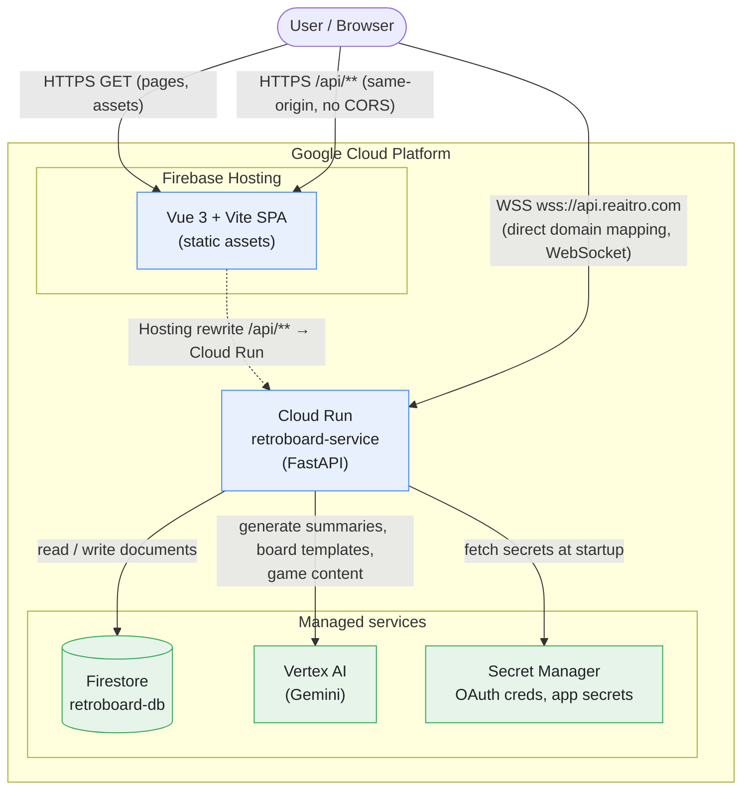
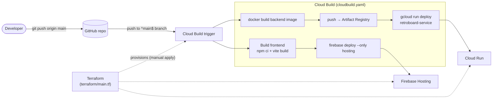
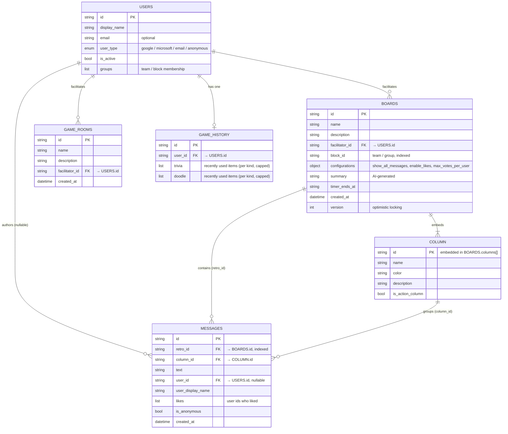

# Architecture

This document describes how **reAItro** (RetroBoard) is put together: the
Google Cloud infrastructure and request/networking flow, the CI/CD pipeline,
and the database design.

For step-by-step deployment instructions see [`../INFRASTRUCTURE.md`](../INFRASTRUCTURE.md).

---

## Deployment targets

The **`main`** branch is the actively maintained production deployment, live at
[reaitro.com](https://reaitro.com):

| Target | Cloud | Frontend hosting | Database | Auth | AI |
|---|---|---|---|---|---|
| **Primary** (`main`) | Google Cloud | Firebase Hosting | Firestore | Google Sign-In + email/password | Vertex AI (Gemini) |
| **Alternative** | Azure | Azure Storage static site | Cosmos DB (Mongo API) | Microsoft AD SSO | OpenAI |

The diagrams below describe the primary Google Cloud deployment. The backend
keeps a database abstraction (`backend/app/db/interfaces.py`) with both
Firestore and MongoDB implementations, and the repo also ships Azure deployment
configs (`azure-pipelines.yml`, `backend/infra/`, `frontend/infra/`) for teams
who prefer to self-host on Azure.

---

## Infrastructure & networking (Google Cloud)

**Why two paths to the backend?**

- **`/api/**` via Firebase Hosting rewrite** - REST calls go to the *same
  origin* as the SPA, so there is no CORS configuration and no extra domain to
  manage. Firebase Hosting proxies these to Cloud Run.
- **`api.reaitro.com` via Cloud Run domain mapping** - Firebase Hosting does
  not proxy WebSocket upgrades, so real-time board/game traffic connects
  directly to Cloud Run through a verified custom-domain mapping.

Cloud Run is deployed with `--min-instances 1` (warm start) and
`session_affinity` enabled for stable WebSocket connections. It runs as a
dedicated service account with least-privilege IAM roles (Firestore user,
Vertex AI user, Secret Manager accessor, etc.).

---

## AI provider abstraction

All AI features funnel through one method, `AIService.call_llm`, which delegates
to a swappable **provider** under `backend/app/services/llm/`:

- `VertexProvider` (Gemini, default) · `OpenAIProvider` (OpenAI-compatible) ·
  `AnthropicProvider` (Claude).
- The active provider is chosen at startup by `AI_PROVIDER` (see the README's
  *AI provider* table). Adapters import their SDKs lazily, so only the selected
  provider's library is needed at runtime.
- High-level methods build provider-agnostic prompts plus a canonical
  (Vertex-format) JSON schema; each adapter translates that schema into its own
  structured-output format (OpenAI `json_schema`, Anthropic forced tool call).
  Prompts and game logic stay identical across providers.

## CI/CD pipeline

- Infrastructure (APIs, Firestore, Artifact Registry, service account + IAM,
  Secret Manager, Cloud Run skeleton, the build trigger, and the API
  domain mapping) is provisioned once with **Terraform**.
- Every push to the **`main`** branch then runs **Cloud Build**, which
  builds and deploys both the frontend (to Firebase Hosting) and the backend
  (to Cloud Run).

---

## Database design (Firestore)

Firestore is schema-less, but the application models
(`backend/app/models/`) define the effective document shapes and the
relationships between collections. There are five top-level collections.

### Collection notes

- **`users`** - Identity records for Google, Microsoft, email/password, and
  anonymous participants. Anonymous guests get an ephemeral session identity
  and are not persisted long-term; only real accounts are stored. `groups`
  expresses team/"block" membership used for board scoping.
- **`boards`** - A retrospective. `columns` and `configurations` are
  **embedded** sub-objects, not separate collections. `block_id` is indexed so
  a team's boards can be listed efficiently. `summary` holds the AI-generated
  write-up. All models inherit `created_at` / `updated_at` / `version` from
  `BaseDBModel` (version supports optimistic locking).
- **`messages`** - Sticky notes. Linked to a board via `retro_id` (indexed)
  and to an embedded column via `column_id`. `user_id` is nullable for
  anonymous posts; `likes` is a denormalized list of user ids.
- **`game_rooms`** - Standalone rooms for the team-games hub (`/play`).
  Deliberately separate from `boards` (no columns, messages, or summary) so
  game rooms never leak into the "My Retro Boards" list and each surface can
  evolve independently.
- **`game_history`** - One document per logged-in user recording recently
  used game content (trivia questions, doodle prompts, …), capped in size, so
  players don't see repeats and the text fed back into AI prompts stays small.

### Key relationships

| From | To | Field | Cardinality |
|---|---|---|---|
| `boards.facilitator_id` | `users.id` | facilitator | many boards → one user |
| `messages.retro_id` | `boards.id` | parent board | many messages → one board |
| `messages.column_id` | embedded `column.id` | parent column | many messages → one column |
| `messages.user_id` | `users.id` | author (nullable) | many messages → one user |
| `messages.likes[]` | `users.id` | who liked | many-to-many |
| `game_rooms.facilitator_id` | `users.id` | facilitator | many rooms → one user |
| `game_history.user_id` | `users.id` | owner | one history → one user |
